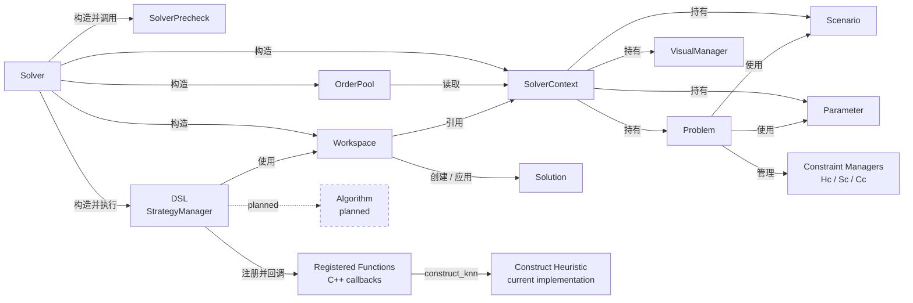
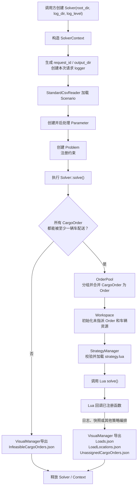

# YUN


## 项目简介

YUN 是一个面向城配和干线取送货场景的车辆路径规划（VRP）求解器。它解决的问题是：在订单、站点、车辆、距离与作业时间等客观条件下，结合业务规则和优化偏好，将货物订单组织为若干车次，为车次选择合适车辆并规划装卸和配送顺序，最终给出车辆路径、成本、计划时间以及未指派订单。

项目把一次求解拆成三个核心概念，分别回答“客观条件是什么”“按什么规则求解”和“具体如何组织求解”：

| 概念        | 定位 | 解决的问题 |
|-----------|---|---|
| `Scenario` | 场景层，不可变输入 | 描述本次求解面对的业务事实 |
| `Problem` | 问题层，模型与规则 | 定义任务模型、约束、成本和可行性 |
| `DSL`       | 策略层，求解过程描述 | 编排求解步骤并调用算法能力 |

### Scenario

`Scenario` 是一次求解任务的输入数据集，是构造实体的载体，保存不可逆的客观事实：位置与工作计划、距离矩阵、车型与车辆、承运商、货物订单，以及用于描述这些对象的维度与标签。场景由 `StandardCsvReader` 加载并预处理，之后不应再被修改。

可以把 `Scenario` 理解为问题实例本身。它只描述“世界是什么样”，不表达对结果的偏好。例如订单必须从哪里提货、送到哪里、车辆有哪些可用资源，都属于场景。

### Problem

`Problem` 是在 `Scenario` 与 `Parameter` 基础上构建的规划模型。它记录可协商的业务规则和偏好。

`Problem` 负责定义一次求解使用何种取送货模式、装卸策略和计划时间范围，并通过三重约束体系评价候选方案：

- 硬约束：不可违反，违反后方案不可行。
- 软约束：允许违反，但会产生惩罚。
- 成本约束：计入目标函数，用于比较方案优劣。

因此，`Scenario` 回答“有哪些事实”，`Problem` 回答“在这些事实上，按什么规则得到合格且更优的方案”。

### DSL

`DSL`(domain specific language) 是项目面向求解策略提供的 `Lua` 编排接口。策略文件固定为 `strategy.lua`，入口为全局函数 `solve()`。e.g.

```lua
function solve()
    log_info("hello world")
    snapshot("A")
    construct_knn()
    snapshot("B")
end
```

`DSL` 不定义业务数据，也不替代问题模型。它描述“一次求解应该按什么顺序执行”，并在脚本中调用 C++ 注册的能力，例如记录日志、保存计划快照、对订单分组、调整车次、以及选用不同的算法。这样，领域对象、约束评价和算法实现留在 C++，策略组合和实验流程可以由 Lua 灵活编排。

三者的关系可以概括为：`Scenario` 提供不可变事实，`Parameter` 表达本次求解参数，二者共同构造 `Problem`；`DSL` 在 `Problem` 提供的规则之上操作 `Workspace`，调用算法能力求解问题。

## 项目框架简介

箭头方向表示依赖或使用关系，即 `A --> B` 表示 `A` 依赖或使用 `B`。实线表示当前代码可验证的生命周期关系或主调用链，虚线表示尚未实现的设计目标。




## 运行流程

下图描述一次完整求解从进程启动到结果本地化的当前实现。实线步骤均可在代码中验证；Lua 策略中可以调用不同能力，图中以当前示例实际使用的 `construct_knn` 为默认路径。



### 1. 本地运行入口

构建和运行入口如下：

```bash
./RUN.sh --mode debug
./build/Debug/tests/vrp_exec
```

`RUN.sh` 先调用 `RUN_CONAN.sh` 安装依赖，再调用 `RUN_BUILD.sh` 配置并编译。当前可执行目标是 `tests/vrp_exec`，其 `main()` 在 `tests/vrp_main.cpp` 中直接调用：

```cpp
Solver* solver = new Solver(root_dir, log_dir, log_level);
solver->solve();
delete solver;
```

当前 `root_dir`、`log_dir` 和日志等级都硬编码在 `tests/vrp_main.cpp`。运行目录 `root_dir` 至少需要包含完整的场景 CSV 以及 `strategy.lua`；程序会把本次运行的新目录写到 `root_dir/output/` 下。

### 2. Solver 初始化

创建 `Solver` 时实际完成的是 `SolverContext` 构造，顺序如下：

1. 生成 `request_id`，格式为 `%Y%m%d%H%M%S_{进程标识}_{序号}`。
2. 拼接本次请求的输出目录：`root_dir/output/{request_id}`。
3. 创建请求级 logger，同时输出到控制台、`log_dir/{request_id}.log` 和 `output_dir/{request_id}.log`。
4. 通过 `StandardCsvReader` 读取场景。
5. 创建并后处理 `Parameter`。
6. 创建 `VisualManager`，负责当前请求的 JSON 结果导出。
7. 创建 `Problem`，建立取送货模式、装卸策略、装载上下文和三重约束管理器。

场景加载不是任意文件并行读取，而是按依赖顺序构造：

| 顺序 | 内容 | 依赖 |
|---|---|---|
| 1 | `Dimension` | 无 |
| 2 | `Label`、`LabelValue`、`LabelApply` | `Dimension` |
| 3 | `Location`、站点标签、工作计划 | `Label`、`Dimension` |
| 4 | `DistMatrix` | `Location` |
| 5 | `VehicleModel`、车型维度、车型标签 | `Dimension`、`Label`、`DistMatrix` |
| 6 | `Carrier`、`Vehicle`、可用车辆 | `Label`、`VehicleModel`、`Location` |
| 7 | `CargoOrder` 及子订单维度、标签 | `Location`、`Dimension`、`Label` |

`Problem` 创建后立刻注册基础硬约束 `HcVehicleCapacity`、`HcAvailableVehicle`，再根据 `Parameter` 决定是否增加时间窗、最大节点数、距离软约束和距离成本约束。

### 3. 主求解链路

`Solver::solve()` 按固定顺序执行：

1. **预检**：逐个检查 `CargoOrder` 是否存在可行车辆。只要检查结果中存在不可解订单，就写出 `InfeasibleCargoOrders.json` 并直接返回，不执行后续订单合并和策略脚本。
2. **构造订单池**：先按提货点与卸货点组合分组，再按 `Parameter` 中的标签规则细分，最后把每组 `CargoOrder` 合并为模型层 `Order`。
3. **构造工作区**：把订单池中的所有 `Order` 放入 `unassigned_orders`，并根据承运商与车辆数据创建可占用、可深拷贝的车辆资源；初始 `loads` 为空。
4. **构造策略管理器**：在 `root_dir/strategy.lua` 存在时创建 Lua 虚拟机，打开基础库，注册 C++ 回调，然后立即加载脚本。
5. **执行策略**：调用 Lua 全局函数 `solve()`。C++ 当前向脚本暴露以下能力：
    - `log_info`、`log_debug`、`log_warn`、`log_error`：写入请求日志。
    - `snapshot(target_dir)`：把当前 Workspace 快照写入本次输出目录下的子目录。
    - `KnnParameter`：构造 KNN 参数对象。
    - `construct_knn()` 或 `construct_knn(KnnParameter)`：执行 K 近邻构造启发式。
6. **执行构造启发式**：`construct_knn` 根据提货、卸货距离构造订单邻接关系，优先把订单插入已有 `Load`；无法插入时按最晚卸货时间选择种子订单构造新 `Load`，为每次变更评估约束并选择最佳车辆，最后把结果覆盖回 `Workspace`。
7. **导出最终结果**：Lua 脚本正常结束后，读取 Workspace 的 `loads_view()` 和 `unassigned_orders_view()`，转换为可视化对象并写入 JSON。

### 4. 输出与退出

一次正常运行会产生：

| 位置 | 文件 | 内容 |
|---|---|---|
| `root_dir/output/{request_id}/` | `Loads.json` | 车次维度的车辆、装载、路线、成本和计划时间 |
| `root_dir/output/{request_id}/` | `LoadLocations.json` | 车次站点顺序及站点级作业信息 |
| `root_dir/output/{request_id}/` | `UnassignedCargoOrders.json` | 未指派订单明细 |
| `root_dir/output/{request_id}/` | `{request_id}.log` | 本次请求日志 |
| `log_dir/` | `{request_id}.log` | 本次请求日志 |

如果预检发现不可解订单，则当前实现只写 `InfeasibleCargoOrders.json` 和日志，不生成 `Loads.json`、`LoadLocations.json`、`UnassignedCargoOrders.json`。如果 Lua 脚本调用 `snapshot(target_dir)`，对应子目录下会额外保留当时的计划结果快照。

`Solver` 析构时释放 `context`、`order_pool` 和 `workspace`；`SolverContext` 析构时先刷新 logger，再释放 `Scenario`、`Parameter`、`VisualManager` 和 `Problem`。

### 5. 当前边界

- `Algorithm` 仍是设计目标。当前可执行的构造入口是 `construct_knn`，Lua 负责编排，具体计算留在 C++。
- `Parameter.csv` 已有表结构定义，但 `load_parameter()` 中的文件读取仍是 `TODO`；当前运行使用 `Parameter` 的默认值，并仅根据场景订单时间范围后处理计划时间范围。
- Lua `solve()` 是策略脚本的入口。脚本不存在、加载失败、执行失败或未定义可调用的 `solve` 都会使本次求解失败。
- 预检是全局短路：存在不可解订单时，本次请求不会继续为其余可行订单生成规划结果。
