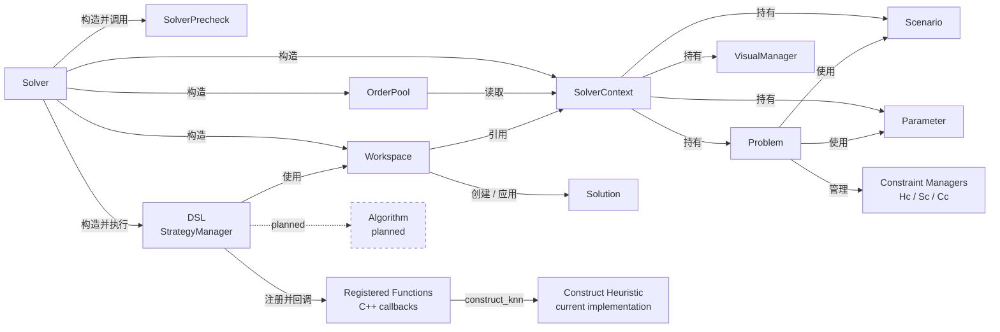

# 项目框架简介

## 关联关系

箭头方向表示依赖或使用关系，即 `A --> B` 表示 `A` 依赖或使用 `B`。实线表示当前代码可验证的生命周期关系或主调用链，虚线表示尚未实现的设计目标。

```mermaid
flowchart LR
solver[Solver]
precheck[SolverPrecheck]
context[SolverContext]
order_pool[OrderPool]
workspace[Workspace]
solution[Solution]
dsl["DSL<br/>StrategyManager"]
funcs["Registered Functions<br/>C++ callbacks"]
algorithm["Algorithm<br/>planned"]:::planned
construct["Construct Heuristic<br/>current implementation"]
scenario[Scenario]
parameter[Parameter]
problem[Problem]
constraints["Constraint Managers<br/>Hc / Sc / Cc"]
visual[VisualManager]

solver -->|构造并调用| precheck
solver -->|构造| context
solver -->|构造| order_pool
solver -->|构造| workspace
solver -->|构造并执行| dsl

order_pool -->|读取| context
workspace -->|引用| context
workspace -->|创建 / 应用| solution

dsl -->|使用| workspace
dsl -->|注册并回调| funcs
funcs -->|construct_knn| construct
dsl -.->|planned| algorithm

context -->|持有| scenario
context -->|持有| parameter
context -->|持有| problem
context -->|持有| visual

problem -->|使用| scenario
problem -->|使用| parameter
problem -->|管理| constraints

classDef planned stroke-dasharray: 5 5
```
