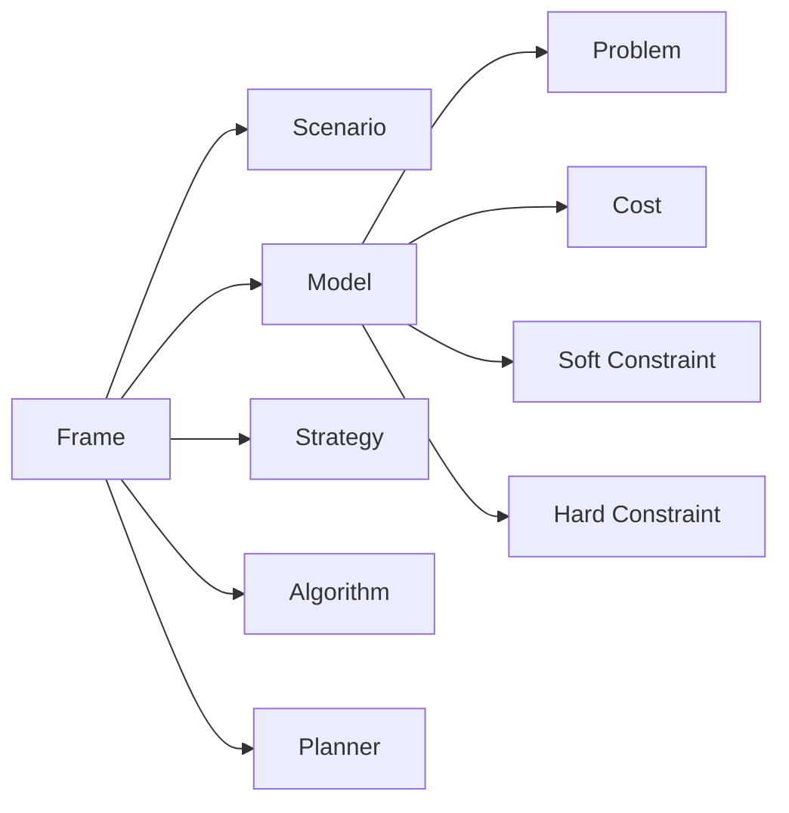

```mermaid
graph LR
frame[Frame] --> scenario[Scenario]
frame --> model[Model]
model --> problem[Problem]
model --> cost[Cost]
model --> soft_constraint[Soft Constraint]
model --> hard_constraint[Hard Constraint]
frame --> strategy[Strategy]
frame --> algorithm[Algorithm]
frame --> planner[Planner]

```
