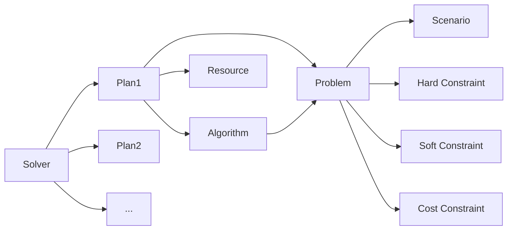

# 项目框架简介

## 运作关系

```mermaid
graph LR
solver[Solver]
algorithm[Algorithm]
plan[Plan1]
plan_m1[Plan2]
plan_mN[...]
problem[Problem]
scenario[Scenario]
resource[Resource]
hard_constr[Hard Constraint]
soft_constr[Soft Constraint]
cost_constr[Cost Constraint]

solver --> plan
solver --> plan_m1
solver --> plan_mN
plan --> algorithm
plan --> problem
plan --> resource
algorithm --> problem
problem --> scenario
problem --> hard_constr
problem --> soft_constr
problem --> cost_constr

```

